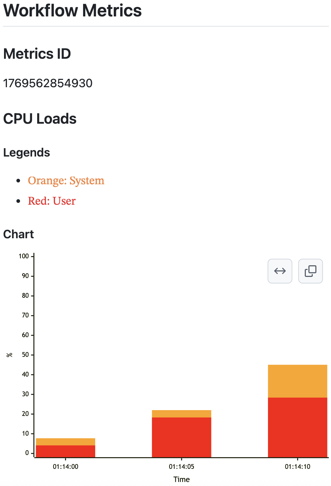
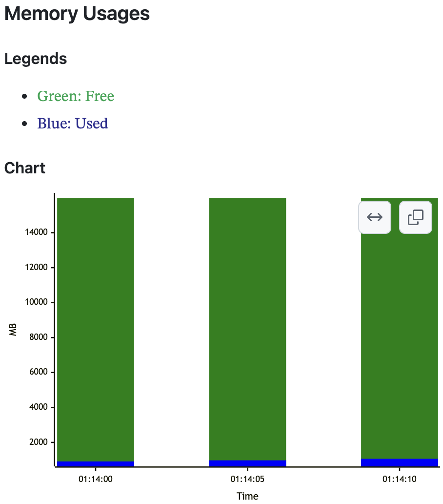
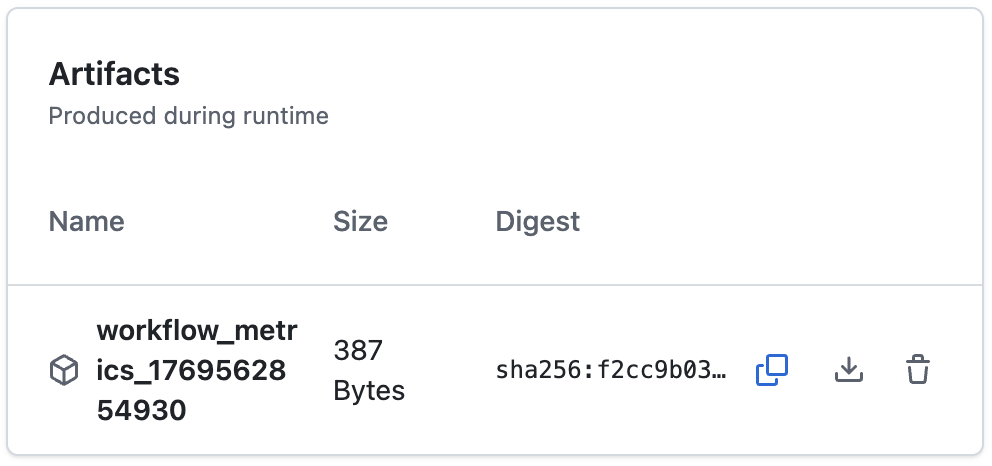

# actions-workflow-metrics

English | [日本語](README.ja.md)

A GitHub Actions for collecting system metrics during workflows and outputting Mermaid charts.

## Features

- **System Metrics Collection**: Collects CPU load and memory usage in real-time during workflow execution
- **Per-Step Metrics**: Breaks down metrics for each workflow step using the GitHub API
- **Mermaid Chart Generation**: Visualizes collected metrics as Mermaid stacked bar charts
- **Job Summary Output**: Automatically displays charts in GitHub Actions job summary

## Output Example

The following charts and data are output.

### CPU Loads

Stacked bar chart of system/user CPU load.



### Memory Usages

Stacked bar chart of active/available memory.



### Artifacts

JSON data of CPU Loads and Memory Usages.



## Usage

This action is designed to be executed at the **beginning** of a workflow.

```yaml
name: Example Workflow

on: [push]

jobs:
  example:
    runs-on: ubuntu-latest
    steps:
      # Run actions-workflow-metrics at the beginning of the workflow
      - name: Start Workflow Telemetry
        uses: dev-hato/actions-workflow-metrics@v1
        with:
          github_token: ${{ secrets.GITHUB_TOKEN }}

      # Subsequent regular steps
      - name: Checkout
        uses: actions/checkout@v4

      - name: Run tests
        run: npm test

      # ... other steps
```

### Execution Flow

1. **main** (workflow start): Starts metrics collection server in the background
2. **Workflow steps**: Execute normally while metrics are collected in the background
3. **post** (workflow end): Renders collected metrics as Mermaid charts and outputs to job summary

## Tech Stack

- **Node.js**: 24.x
- **TypeScript**: 5
- **Package Manager**: Bun
- **Key Libraries**:
  - `systeminformation`: System metrics collection
  - `zod`: Schema validation
  - `@actions/core`: GitHub Actions integration
  - `@octokit/action`: GitHub API client for per-step metrics

## Development Setup

### 1. Install Dependencies

```bash
bun install
```

### 2. Setup pre-commit (Recommended)

For security, install [pre-commit](https://pre-commit.com/). It automatically checks for credentials on commit.

```bash
# macOS
brew install pre-commit

# or using pip
pip install pre-commit

# Install pre-commit hooks
pre-commit install
```

This automatically runs gitleaks on commit.
It checks for sensitive information like API keys or tokens.

## Development Commands

```bash
# Type check + bundle (outputs to dist/ directory)
bun run build

# Run unit tests (Bun test runner)
bun test

# Code formatting (Prettier)
bun run fix
```

## Project Structure

```text
src/
├── lib.ts                 # Common schema and server settings
├── main/
│   ├── index.ts           # main entry point (server startup)
│   ├── server.ts          # Metrics collection HTTP server
│   ├── metrics.ts         # Metrics class (metrics management)
│   └── metrics.test.ts    # Metrics class tests
└── post/
    ├── index.ts           # post entry point (job summary output)
    ├── lib.ts             # Metrics fetch and rendering
    ├── lib.test.ts        # Rendering logic tests
    ├── renderer.ts        # Mermaid chart generation
    └── renderer.test.ts   # Mermaid chart generation tests
```

## Architecture

### main Execution

1. `src/main/index.ts` is executed
2. Node.js spawns `src/main/server.ts` as a detached process
3. Server starts serving metrics JSON at `localhost:7777`
4. `Metrics` class collects CPU/memory information every 5 seconds using `systeminformation` library

### post Execution

1. `src/post/index.ts` is executed
2. Fetches metrics JSON from `localhost:7777` (timeout: 10 seconds)
3. `Renderer` class generates Mermaid charts
4. Outputs to job summary using `@actions/core` `summary` API

## License

[MIT License](LICENSE)
